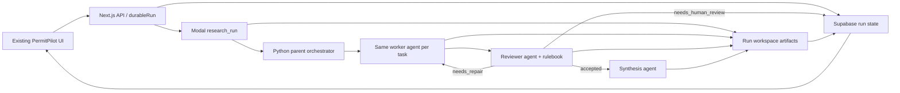

# CrossBeam-Style Modal Workspace Runtime Implementation Plan

> **For agentic workers:** REQUIRED SUB-SKILL: Use `superpowers:executing-plans` to carry this plan out. Full build, phased implementation. Do not rewrite the UI; adapt the existing PermitPilot UI to the new runtime events and artifacts.

**Goal:** Rebuild the PermitPilot research runtime around a CrossBeam-like parent/worker/reviewer loop running in Modal, using the Python OpenAI Agents SDK, durable workspace artifacts, and a human-like reviewer agent with a rulebook. The reviewer decides whether the work is accepted, needs repair, or needs human review. Deterministic checks provide evidence hygiene and audit signals, but they do not replace reviewer judgment.

**Architecture:** Next.js remains the existing UI and polling surface. Supabase remains durable run state. Modal hosts the Python runtime. A parent orchestrator creates a run workspace, fans out specialist workers, asks a reviewer agent to critique outputs against a rulebook, sends critique back to the same worker for repair, then synthesizes accepted artifacts into the existing UI shape.

**Tech Stack:** Next.js, TypeScript, Supabase, Modal, Python 3.11, `openai-agents` (`from agents import Agent, Runner, function_tool`), existing PermitPilot research skills, Vitest, plain Python pytest-style scripts.

---

## Current State

The repo already has a durable research path and useful local guardrails:

- `src/lib/research/modal/worker.py` runs Modal jobs and writes Supabase run status.
- `src/lib/research/modal/worker_core.py` owns current research helpers, source allowlists, source pointers, budgets, and evidence assembly.
- `src/lib/research/store/supabaseStore.ts` persists run records, trace events, evidence, determinations, and report markdown.
- `src/lib/ui/sandboxState.ts`, `app/components/TraceStream.tsx`, `app/components/SandboxGrid.tsx`, `app/components/ReportOverlay.tsx`, `app/components/EvidenceDrawer.tsx`, and `app/components/RepairTicketsCard.tsx` already expose the right UI surfaces.
- `src/lib/research/modal/pytests/worker_core_test.py` and `worker_core_adversarial_eval.py` already protect evidence hygiene.

What changes is the runtime model: instead of a custom single-pass chat/tool loop, Modal becomes a durable workspace runtime with a parent orchestrator, worker agents, reviewer agent, repair loop, and synthesis step.

## Target Runtime



Runtime phases emitted through `trace_events`:

- `workspace.booting`
- `parent.planning`
- `research_worker.fetching`
- `research_worker.drafting`
- `reviewer.reviewing`
- `research_worker.repairing`
- `reviewer.accepted`
- `reviewer.needs_human_review`
- `synthesis.matrix`
- `synthesis.report`

The existing UI can display these with small adapters rather than a redesign.

## Non-Goals

- Do not build a new UI.
- Do not move the app off Supabase.
- Do not replace all TypeScript planning/registry code in one pass.
- Do not make deterministic verification the acceptance authority.
- Do not create a minimal demo slice. This is a full build split into safe phases.

## Phase 1: Workspace and Durable State

### Task 1.1: Add Python runtime smoke test

Edit `package.json` and add a Python runtime test script:

```json
"py:test": "python3 src/lib/research/modal/pytests/worker_core_test.py && python3 src/lib/research/modal/pytests/worker_core_adversarial_eval.py && python3 src/lib/research/modal/pytests/agents_sdk_smoke_test.py"
```

Create `src/lib/research/modal/pytests/agents_sdk_smoke_test.py`:

```python
def test_agents_sdk_imports():
    from agents import Agent, Runner, function_tool

    assert Agent is not None
    assert Runner is not None
    assert function_tool is not None


if __name__ == "__main__":
    test_agents_sdk_imports()
```

Expected command:

```bash
pnpm py:test
```

Expected result before installing local Python deps may fail with `ModuleNotFoundError: No module named 'agents'`. That failure is useful and should be resolved by installing `openai-agents` in the active local Python environment and Modal image.

### Task 1.2: Install Python Agents SDK in Modal image

Edit `src/lib/research/modal/worker.py`.

Change the Modal image package list from:

```python
image = modal.Image.debian_slim(python_version="3.11").pip_install(
    "httpx",
    "pymupdf",
    "beautifulsoup4",
    "openai",
    "fastapi[standard]",
    "supabase",
)
```

to:

```python
image = modal.Image.debian_slim(python_version="3.11").pip_install(
    "httpx",
    "pymupdf",
    "beautifulsoup4",
    "openai",
    "openai-agents",
    "fastapi[standard]",
    "supabase",
)
```

Expected command:

```bash
python3 src/lib/research/modal/pytests/agents_sdk_smoke_test.py
```

Expected result:

```text
no output, exit code 0
```

### Task 1.3: Add workspace core helpers

Create `src/lib/research/modal/workspace_core.py`.

Implement:

```python
from __future__ import annotations

import json
from dataclasses import dataclass
from datetime import datetime, timezone
from pathlib import Path
from typing import Any


@dataclass(frozen=True)
class ArtifactRef:
    kind: str
    path: str
    task_id: str | None = None
    hypothesis_id: str | None = None


def utc_now_iso() -> str:
    return datetime.now(timezone.utc).isoformat()


def run_workspace(root: Path, run_id: str) -> Path:
    return root / run_id


def ensure_workspace(root: Path, run_id: str) -> Path:
    workspace = run_workspace(root, run_id)
    for child in ("tasks", "reviews", "repairs", "synthesis", "logs"):
        (workspace / child).mkdir(parents=True, exist_ok=True)
    return workspace


def write_json(path: Path, payload: dict[str, Any]) -> None:
    path.parent.mkdir(parents=True, exist_ok=True)
    path.write_text(json.dumps(payload, indent=2, sort_keys=True), encoding="utf-8")


def read_json(path: Path) -> dict[str, Any]:
    return json.loads(path.read_text(encoding="utf-8"))


def append_event(workspace: Path, event: dict[str, Any]) -> None:
    path = workspace / "logs" / "timeline.jsonl"
    path.parent.mkdir(parents=True, exist_ok=True)
    payload = {"ts": utc_now_iso(), **event}
    with path.open("a", encoding="utf-8") as handle:
        handle.write(json.dumps(payload, sort_keys=True) + "\n")
```

### Task 1.4: Test workspace helpers

Create `src/lib/research/modal/pytests/workspace_core_test.py`.

Cover:

- `ensure_workspace` creates `tasks`, `reviews`, `repairs`, `synthesis`, and `logs`.
- `write_json` and `read_json` round-trip nested payloads.
- `append_event` writes JSONL timeline entries.

Update `package.json` `py:test` to include the new test.

Expected command:

```bash
pnpm py:test
```

Expected result: all Python tests exit 0.

### Task 1.5: Add durable artifact metadata

Edit `supabase/migrations/0001_research_runtime.sql`.

Add nullable columns to `research_runs`:

```sql
alter table research_runs
  add column if not exists workspace_prefix text,
  add column if not exists artifact_index jsonb not null default '[]'::jsonb;
```

Edit `src/lib/research/store/supabaseStore.ts`.

Add to `RunRecord`:

```ts
workspace_prefix?: string | null;
artifact_index?: unknown[];
```

Make `createRun`, `getRun`, and `finalizeRun` preserve those fields when present.

Add/extend `src/lib/research/store/__tests__/supabaseStore.test.ts` to assert artifact metadata survives row normalization.

Expected command:

```bash
pnpm vitest run src/lib/research/store/__tests__/supabaseStore.test.ts
```

Expected result: tests pass.

## Phase 2: Parent Orchestrator and Worker Agents

### Task 2.1: Add runtime schemas

Create `src/lib/research/modal/runtime_models.py`.

Use dataclasses so tests can run without Pydantic dependency churn:

```python
from __future__ import annotations

from dataclasses import dataclass, field
from typing import Any, Literal

ReviewDecision = Literal["accepted", "needs_repair", "needs_human_review"]


@dataclass(frozen=True)
class RuntimeTask:
    task_id: str
    hypothesis_id: str
    question: str
    family: str
    skill_id: str | None
    allowed_domains: list[str] = field(default_factory=list)
    input: dict[str, Any] = field(default_factory=dict)


@dataclass(frozen=True)
class WorkerDraft:
    task_id: str
    hypothesis_id: str
    answer: str
    evidence: list[dict[str, Any]]
    caveats: list[str]
    artifact_path: str


@dataclass(frozen=True)
class ReviewFinding:
    severity: Literal["blocker", "major", "minor"]
    signal: str
    explanation: str
    repair_instruction: str


@dataclass(frozen=True)
class ReviewResult:
    task_id: str
    decision: ReviewDecision
    findings: list[ReviewFinding]
    accepted_evidence_ids: list[str]
    artifact_path: str
```

Add `src/lib/research/modal/pytests/runtime_models_test.py` to assert simple construction and expected decision strings.

### Task 2.2: Build Agents SDK wrapper

Create `src/lib/research/modal/agents_runtime.py`.

Implement factory functions:

- `build_research_worker_agent(task: RuntimeTask, rulebook: str) -> Agent`
- `build_reviewer_agent(rulebook: str) -> Agent`
- `run_worker_draft(task: RuntimeTask, rulebook: str, context: dict[str, Any]) -> WorkerDraft`
- `run_worker_repair(task: RuntimeTask, original: WorkerDraft, review: ReviewResult, rulebook: str) -> WorkerDraft`
- `run_review(task: RuntimeTask, draft: WorkerDraft, rulebook: str) -> ReviewResult`

Important behavior:

- Use `Agent` and `Runner` from `agents`.
- Keep deterministic evidence tools from `worker_core.py` available through `function_tool`.
- The worker must write an answer with evidence pointers, not final permit prose.
- The reviewer must cite rulebook signals in findings.
- The repair call must address the same worker identity/task context and include the reviewer critique verbatim as repair instructions.

Skeleton:

```python
from __future__ import annotations

import json
from agents import Agent, Runner, function_tool

from .runtime_models import ReviewFinding, ReviewResult, RuntimeTask, WorkerDraft


def build_research_worker_agent(task: RuntimeTask, rulebook: str) -> Agent:
    return Agent(
        name=f"PermitPilot worker {task.task_id}",
        instructions=(
            "You are a specialist EHS permit research worker. "
            "Use the available rulebook and source constraints. "
            "Return grounded task evidence, caveats, and no unsupported conclusions.\n\n"
            f"RULEBOOK:\n{rulebook}"
        ),
    )
```

Test with mocked `Runner.run` rather than live OpenAI calls.

Create `src/lib/research/modal/pytests/agents_runtime_test.py`:

- Monkeypatch `Runner.run` to return an object with `final_output`.
- Assert `run_review` parses `needs_repair` with findings.
- Assert `run_worker_repair` includes the original draft and reviewer findings in input.

### Task 2.3: Add rulebook module

Create `src/lib/research/modal/rulebook.py`.

It should compose the reviewer rulebook from:

- hard source rules already represented in `worker_core.py`
- jurisdiction/skill instructions for the task
- project-specific review signals:
  - Is the claim grounded by a real allowed source?
  - Is applicability separated from compliance obligation?
  - Is the conclusion scoped to the facility facts?
  - Are missing facts called out instead of guessed?
  - Are SDS-driven determinations explicit when relevant?
  - Are local agency and state/federal jurisdiction layers separated?
  - Does the answer avoid overclaiming exemptions?

Expose:

```python
def build_rulebook(task: RuntimeTask, skill_text: str | None = None) -> str:
    ...
```

Test that the rulebook includes the task family, allowed domains, and the repair policy.

### Task 2.4: Add parent state machine

Create `src/lib/research/modal/orchestrator_runtime.py`.

Implement a pure orchestration function that accepts injected callables so it can be tested without Modal or OpenAI:

```python
def run_task_with_review(
    task: RuntimeTask,
    workspace_root: Path,
    rulebook: str,
    draft_fn: Callable[[RuntimeTask, str], WorkerDraft],
    review_fn: Callable[[RuntimeTask, WorkerDraft, str], ReviewResult],
    repair_fn: Callable[[RuntimeTask, WorkerDraft, ReviewResult, str], WorkerDraft],
    max_repairs: int = 2,
) -> ReviewResult:
    ...
```

Behavior:

- Emit timeline events for draft, review, repair, accepted, and needs human review.
- The same `RuntimeTask` is sent to `repair_fn`; do not create a replacement worker.
- Stop after `max_repairs`.
- Accepted result returns immediately.
- Repeated `needs_repair` after max repairs becomes `needs_human_review`.

Create `src/lib/research/modal/pytests/orchestrator_runtime_test.py`.

Test:

- accepted first pass
- repair once then accepted
- max repair attempts becomes human review
- timeline artifacts are written

## Phase 3: Modal Integration and Supabase Events

### Task 3.1: Convert current task specs to runtime tasks

Edit `src/lib/research/modal/worker.py`.

Add conversion near `research_run`:

```python
def _runtime_task_from_spec(task_spec: dict[str, Any]) -> RuntimeTask:
    return RuntimeTask(
        task_id=task_spec["task_id"],
        hypothesis_id=task_spec["hypothesis_id"],
        question=task_spec["question"],
        family=task_spec.get("family", "unknown"),
        skill_id=task_spec.get("skill_id"),
        allowed_domains=task_spec.get("allowed_domains", []),
        input=task_spec,
    )
```

Preserve the existing `_run(task_spec)` function until the new orchestrator tests pass, then route `research_run` through runtime tasks.

### Task 3.2: Add trace event mapper

Create `src/lib/research/modal/trace_events.py`.

Expose:

```python
def trace_event(actor: str, phase: str, status: str, message: str, ref_id: str | None = None) -> dict[str, Any]:
    ...
```

Map runtime phases to current UI-friendly fields:

- actor: `parent`, `research_worker`, `reviewer`, `synthesis_agent`
- status: `queued`, `running`, `done`, `failed`, `needs_review`
- phase: free-form runtime phase string

Test event shape and stable IDs when `ref_id` is provided.

### Task 3.3: Wire `research_run` to workspace runtime

Edit `src/lib/research/modal/worker.py`.

In `research_run`:

1. `updateStatus(run_id, "running", {"trace_events": [...]})`
2. `ensure_workspace(Path("/tmp/permitpilot-runs"), run_id)`
3. Convert task specs to `RuntimeTask`.
4. For each task, build rulebook and call `run_task_with_review`.
5. Write draft/review/repair artifacts into workspace.
6. Upsert evidence bundles only for accepted or human-review tasks.
7. Set status to `bundles_complete` once all task reviews are terminal.
8. Include `workspace_prefix` and `artifact_index` in the run update.

Keep Modal fanout if it can pass the same worker repair loop per task. If fanout makes same-worker repair hard to reason about, run tasks sequentially inside the parent first, then reintroduce fanout after tests prove deterministic orchestration.

### Task 3.4: Add Modal integration tests with fakes

Create `src/lib/research/modal/pytests/worker_runtime_test.py`.

Do not call Modal or OpenAI. Patch:

- Supabase client calls
- draft/review/repair functions
- filesystem root

Assert:

- status starts as `running`
- reviewer events are emitted
- repair events are emitted when review says `needs_repair`
- final status is `bundles_complete`
- artifact index includes draft and review paths

## Phase 4: Synthesis and Existing UI Adapter

### Task 4.1: Add synthesis runtime

Create `src/lib/research/modal/synthesis_runtime.py`.

Inputs:

- accepted `WorkerDraft` artifacts
- `ReviewResult` artifacts
- existing run input/scope

Outputs:

- `determinations` compatible with `supabaseStore.finalizeRun`
- `report_markdown`
- `repair_tickets` for unresolved `needs_human_review`
- `verification_verdicts` where reviewer acceptance maps to `pass`, reviewer human review maps to `needs_review`, and deterministic hygiene failure maps to `fail`

The synthesis agent may use `Agent`/`Runner`, but it must not invent evidence. It can only summarize accepted artifacts or mark unknowns.

### Task 4.2: Adapt `sandboxState` for reviewer phases

Edit `src/lib/ui/sandboxState.ts`.

Add status handling:

- `reviewer.reviewing` + `running` means tile status `verifying`
- `research_worker.repairing` + `running` means tile status `repairing`
- `reviewer.accepted` + `done` means tile status `verified` or `repaired`
- `reviewer.needs_human_review` + `needs_review` means tile status `needs_review`

Add tests next to existing UI tests or create `src/lib/ui/__tests__/sandboxState.test.ts`.

### Task 4.3: Keep `TraceStream` visual surface, extend labels only

Edit `app/components/TraceStream.tsx` only if runtime phases render confusingly.

Allowed edits:

- Add display labels for `reviewer`, `research_worker`, `parent`.
- Add status color mapping for `needs_review` if missing.
- Do not redesign the component.

### Task 4.4: Surface artifact links in existing panels

Edit only the existing UI components:

- `app/components/EvidenceDrawer.tsx`
- `app/components/RepairTicketsCard.tsx`
- `app/components/VerificationSummary.tsx`

Add small artifact metadata display when present:

- draft artifact
- reviewer artifact
- repair count
- reviewer decision

Do not add new major layout sections.

### Task 4.5: Durable polling should preserve runtime status

Edit `src/lib/research/durable/durableRun.ts` and relevant API route tests.

Ensure:

- `running` stays running while Modal runtime is active.
- `bundles_complete` triggers synthesis/finalization if that is still the existing app contract.
- `needs_review` remains visible instead of being overwritten as failed.
- `artifact_index` is returned to UI mappers.

Run:

```bash
pnpm vitest run src/lib/research/durable/__tests__/durableRun.test.ts
```

Note: if this still fails because local `node_modules` is missing `@openai/agents`, install dependencies or run in the project environment that has them.

## Phase 5: Evaluation and Regression Suite

### Task 5.1: Reviewer-loop adversarial eval

Create `src/lib/research/modal/pytests/reviewer_loop_adversarial_eval.py`.

Cases:

- worker omits allowed source URL -> reviewer says `needs_repair`
- worker overclaims exemption -> reviewer says `needs_repair`
- worker guesses missing facility fact -> reviewer says `needs_repair`
- worker repairs with grounded quote/source -> reviewer says `accepted`
- repeated bad repair -> reviewer says `needs_human_review`

Run:

```bash
python3 src/lib/research/modal/pytests/reviewer_loop_adversarial_eval.py
```

Expected result:

```text
5/5 reviewer loop defects caught
```

### Task 5.2: Full local verification

Run:

```bash
pnpm py:test
pnpm vitest run src/lib/research/modal/__tests__/researchPool.test.ts src/lib/research/store/__tests__/supabaseStore.test.ts src/lib/research/durable/__tests__/durableRun.test.ts
pnpm vitest run src/lib/ui/__tests__/sandboxState.test.ts app/components/__tests__/EvidenceDrawer.test.tsx app/components/__tests__/ReportOverlay.test.tsx
```

Expected result:

- Python runtime tests pass.
- Modal pool/store/durable/UI tests pass.
- Any `@openai/agents` install failure is treated as an environment setup issue, not a runtime design failure.

### Task 5.3: Modal dry run

Run a single known facility scenario against the Modal runtime with a tiny task set:

```bash
modal run src/lib/research/modal/worker.py::research_run --run-id <dev-run-id>
```

Expected trace:

- workspace booting
- parent planning
- worker drafting
- reviewer reviewing
- optional worker repairing
- reviewer accepted or needs human review
- synthesis report

Expected Supabase:

- run status reaches `bundles_complete` or `done`
- `trace_events` contains reviewer phases
- `artifact_index` contains draft/review/repair/synthesis files

## Failure Modes to Watch

- Reviewer becomes a deterministic schema checker in disguise. Fix by keeping rulebook signals qualitative and decision-oriented.
- Repair creates a new worker context. Fix by passing the same `RuntimeTask`, original draft, and reviewer critique into `run_worker_repair`.
- UI loses progress because new phases are not mapped. Fix in `sandboxState` before changing components.
- Modal worker writes artifacts but Supabase does not expose them. Fix `artifact_index` normalization in `supabaseStore`.
- Synthesis invents unsupported conclusions. Fix by making synthesis consume only accepted artifacts and reviewer decisions.
- Tests accidentally call live OpenAI. Fix by monkeypatching `Runner.run` in unit tests and isolating live eval behind explicit commands.

## Execution Order

1. Phase 1: workspace core, Modal dependency, durable artifact metadata.
2. Phase 2: runtime schemas, Agents SDK wrappers, reviewer rulebook, parent repair loop.
3. Phase 3: Modal integration with faked tests first, then real Modal dry run.
4. Phase 4: existing UI adapters only.
5. Phase 5: adversarial reviewer-loop eval and focused regression suite.

## Acceptance Criteria

- A run has durable workspace artifacts for drafts, reviews, repairs, and synthesis.
- The reviewer agent, not a deterministic checker, controls accept/repair/human-review decisions.
- The same worker task receives critique and performs repairs.
- Existing UI shows progress, reviewer outcomes, repair tickets, and evidence without redesign.
- Supabase records enough artifact metadata for replay/debugging.
- Python unit tests prove the state machine and reviewer loop without live model calls.
- Focused TypeScript tests prove durable polling and UI adapters still work.

